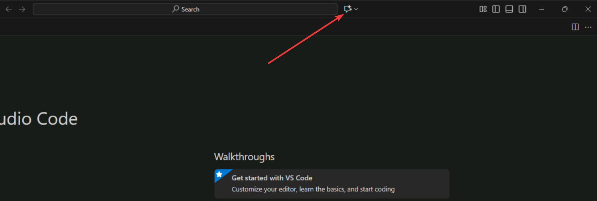
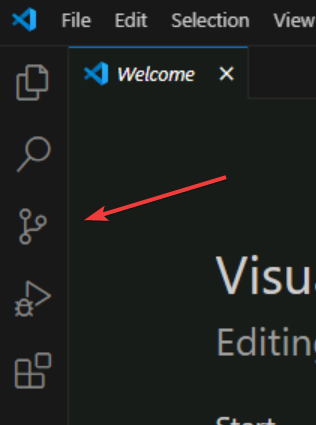

# Workshop setup

To complete this workshop you will need to clone a repository with a copy of the contents of this repository

> [!Hint]
> Under regular conditions you would need to ensure all requirements, but don't worry. We have ensured this environment has all you need.

## Configure GitHub Copilot

> [!NOTE]
> For your convenience we have the username and password on the instructions, but you can also see their values in the **Resources** tab


1. [] Open Visual Studio Code
2. [] Click on Copilot icon on top bar (left side next to the search input box)



3. [] Click on **Open Chat** option (if you clicked on the dropdown arrow, otherwise the window is now open)
4. [] If there is a login button on the chat window, click it, otherwise type something and press enter in the chat input box to force the login window
5. [] Click on **Continue with GitHub** blue button on the modal window
6. [] A browser will automatically open, enter on the login input `user_events` (the password input will be greyed out once you enter the username) click on green **Sign in with your identity provider** button
7. [] Click **Continue** button on the **Single sign-on** page
8. [] Enter +++@lab.CloudPortalCredential(User1).Username+++ on the **Email, phone, or Skype** input box and click on **Next**
9. [] Enter +++@lab.CloudPortalCredential(User1).AccessToken+++ on the **Temporary Access Pass** field and click on **Sign in with your entity provider** button
10. [] Click on **yes** in the **Stay signed in?** modal dialog
11. [] Authorize the user by clicking continue and authorize VS Code access to user email by clicking on **Authorize Visual-Studio-Code*** button
12. [] Click **open** when browser asks for the confirmation (**This site is trying to open Visual Studio Code.**)
13. [] After Copilot is setup you should now have a GitHub Copilot **Welcome** open tab in Visual Studio Code

We are now ready to start working on our code with the help of Copilot.

## Clone lab repository

Let's clone the repository you'll use for the lab.

1. [] Click on the Source Control icon on the left sidebar



2. [] Click on **Clone Repository** button
3. [] Type `https://github.com/github-samples/pets-workshop` and press enter.
4. [] Select the repository destination folder (suggestion: use the one is automatically shown. The user home folder) by clicking in **Select as Repository Destination** button.
    - Note: The repository will be cloned to **SELECTED FOLDER/pets-workshop**
5. [] Click **Open** button when asked if you **Would like to open the cloned repository?**
6. [] Click the **Yes, I trust the authors** button when asked.

The code is now open in Visual Studio Code, feel free to take a look at it or skip to the next section to start the app.

## Start the app

1. [] On the menu bar at the top, Click on **...** (three dots, or **Terminal** if already visible) and then select **Terminal -> New Terminal**
2. [] Start the application by running the following command on the terminal:

```pwsh
.\scripts\start-app.ps1
```

The startup script will install dependencies (the first will take a while) and start two applications:

- The backend Flask app on **http://localhost:5100**. You can see a list of dogs by opening the url +++http://localhost:5100/api/dogs+++
- The frontend Astro/Svelte app on +++http://localhost:4321+++. You can see app the by opening that URL.

- [] Try it now, open a browser and navigate to the links provided above.

## Summary and next steps

You've now cloned the repository you'll use for this workshop and have GitHub Copilot setup! Next let's **add a new endpoint to the server**
