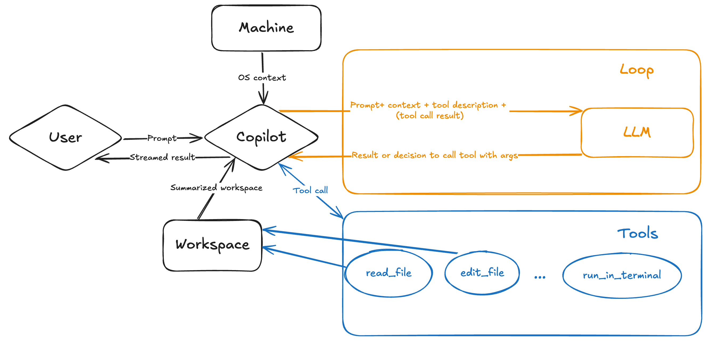
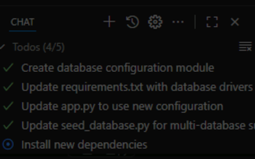
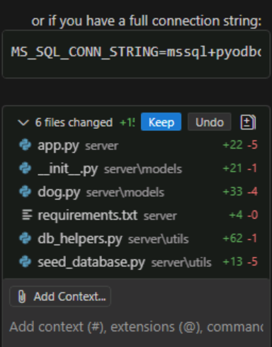
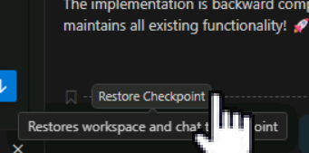

# Modernizing Your Backend with GitHub Copilot Agent Mode


GitHub Copilot can help you modernize and adapt your applications for cloud deployment. One of the most powerful features is Agent mode, which allows Copilot to work autonomously across multiple files to implement complex changes. Let's use this capability to enhance our application's database support.

## Scenario

The shelter's application currently uses SQLite, which works great for development and small deployments. However, as the shelter grows and considers cloud deployment options, they want the flexibility to use enterprise database systems like Microsoft SQL Server or PostgreSQL. You'll use GitHub Copilot's Agent mode to add support for these databases while maintaining backward compatibility with SQLite.

## Overview of Copilot Agent mode

Agent mode is an advanced feature of GitHub Copilot that allows it to work more autonomously on your behalf. Unlike regular chat or edits mode, Agent mode can:

- Autonomously decide which files need to be modified
- Create new files as needed
- Install dependencies and make configuration changes
- Work iteratively to solve complex problems
- Run tests and validate changes

When you activate Agent mode, Copilot becomes your coding partner that can handle end-to-end implementation of features, giving you time to focus on reviewing and validating the changes.



## Adding Copilot Instructions

Copilot instructions is a markdown file is placed in your **.github** folder. It becomes part of your project, and in turn is available to all contributors to your codebase. You can use this file to indicate various coding standards you wish to follow, the technologies your project uses, or anything else important for Copilot Chat to understand when generating suggestions.

> [!IMPORTANT]
> The *copilot-instructions.md* file is included in **every** call to GitHub Copilot Chat, and will be part of the context sent to Copilot. Because there is always a limited set of tokens an LLM can operate on, a large Copilot instructions file can obscure relevant information. As such, you should limit your Copilot instructions file to project-wide information, providing an overview of what you're building and how you're building it. If you need to provide more specific information for particular tasks, you can create [prompt files](https://docs.github.com/en/copilot/customizing-copilot/adding-repository-custom-instructions-for-github-copilot?tool=vscode#about-prompt-files).

Here are some guidelines to consider when creating a Copilot instructions file:

- The Copilot instructions file becomes part of the project, meaning it will apply to every developer; anything indicated in the file should be globally applicable.
- The file is markdown, so you can take advantage of that fact by grouping content together to improve readability.
- Provide an overview of **what** you are building and **how** you are building it, including:
    - languages, frameworks and libraries in use.
    - required assets to be generated (such as unit tests) and where they should be placed.
    - any language specific rules such as:
        - utilize [type hints][type-hints] in Python.
        - use [arrow functions][arrow-functions] rather than the **function** keyword in TypeScript.
- If you notice GitHub Copilot consistently provides an unexpected suggestion (e.g. using class components for React), add those notes to the instructions file.

Let's make Copilot do all the hard work for us by having it create the instructions file.

1. [] Open Copilot Chat.
2. [] Select the **+** icon towards the top of Copilot chat to begin a new chat.
3. [] Click on the **Cog** icon at the top of the Chat window and select **Generate Instructions** from the menu.
4. [] Copilot will analyze the repository and generate a comprehensive instructions file based on the project structure, technologies, and patterns.
5. [] While copilot is generating the instructions, examine the chat window (scroll as necessary), look at the prompt being used, also that Copilot is reading the project files to gather context and write an effective prompt.
6. [] Review the generated instructions. In a real-world scenario, you would customize them with items specific to your enterprise or team requirements (such as internal coding standards, security policies, or organizational best practices). For this lab, you can use the generated instructions as-is.
7. [] Accept the suggested changes by clicking **Keep** on the list of files changed at the bottom of the Copilot Chat window.

Now that we have an instruction file, the Copilot will be more effective when writing code.

## Using Agent mode to add database support

Let's use Agent mode to modify our backend to support multiple database systems.

> [!NOTE]
> While we recommend using Claude Sonnet 4.5 for this exercise, you're free to experiment with other models if you'd like to see how different models approach the same task.

1. []  Close any tabs you may have open in your VS Code to ensure Copilot has a clean context.
1. []  Open or switch to GitHub Copilot Chat.
1. []  Switch to Agent mode by clicking on the chat mode dropdown at the bottom of the Chat view and selecting **Agent**.
    - If asked **Changing the chat mode will end your current session. Would you like to continue?** click **Yes**
    - If you were already in Agent mode, press **+** to start a new session.
1. []  Select **Claude Sonnet 4.5** from the list of available models.
1. []  Send the following prompt to the agent (feel free to make changes to the wording if you'd like to experiment):

> [!IMPORTANT]
> **Do NOT use the "type" button** that appears when hovering over the code block. Instead, **copy and paste** the prompt directly into the chat. Using the type button will cause Copilot to interpret each newline as pressing Enter, executing the prompt immediately after the first line before you can complete the full multi-line prompt.

```text
Add support for Microsoft SQL Server and PostgreSQL in the backend. 
If there is an env variable called MS_SQL_CONN_STRING or PGSQL_CONN_STRING use that connection string to connect to the server. 
Otherwise keep using SQLite like currently. Install additional dependencies and or drivers as needed.
```

> [!NOTE]
> Because LLMs are probabilistic, not deterministic, the exact changes made can vary. The steps below describe a typical experience, but your experience may differ slightly. Also note that we are a little ambiguous in the prompt on purpose to see how the agent interprets it.

## Monitoring the Agent's progress

As the agent works, you'll see it taking various actions. Watch the terminal window and the VS Code interface to observe:

- The prompt we just added being used by the agent
- The agent analyzing the codebase to understand the current database implementation
- The agent will most likely ask for your permission to execute code - carefully examine the request(s) and authorize them if appropriate
- Installation of new Python packages (like `psycopg2` for PostgreSQL or `pyodbc` for SQL Server)
- Code changes being made across multiple files (X files changes list at the bottom of the chat window)
  - If you expand the list and click on file changed, you can see the changes being suggested with a visual diff.
- The agent's reasoning about each step it is taking
- On top of the chat window there may be a **Todos** list, which is the list of things the agent is performing, the list has a **(x/y)** format indicating the number of completed tasks versus the total tasks. You can expand the list and see it being updated in real time. It is a great way to observe how the agent is approaching the task at hand and its progress.



> [!TIP]
> The terminal window will show you the commands the agent is running, including any package installations. The editor will highlight changes as they're made, similar to the diff view you saw with Copilot Edits.

## Expected changes

Copilot should make modifications to at least two key files:

- **server/app.py** - Updates to the database initialization to support multiple database types
- **server/utils/seed_database.py** - Changes to the seeding logic to work with different database systems

Copilot will typically:

1. Add logic to check for environment variables (**MS_SQL_CONN_STRING** or **PGSQL_CONN_STRING**)
2. Configure SQLAlchemy to use the appropriate database connection based on available environment variables
3. Install required database drivers (like **pyodbc**, **psycopg2-binary**)
4. Update the **requirements.txt** file with new dependencies
5. Ensure backward compatibility with SQLite as the default

## Handling (potential) incomplete changes

> [!IMPORTANT]
> Sometimes the agent might not modify all necessary files on the first attempt. This can happen if the prompt isn't explicit enough or if the agent prioritizes certain changes over others. This is a normal part of working with AI agents, and you can guide them with follow-up prompts.

**If you notice** that the changes to **server/seed_database.py** were not made because it is not on the **changed files** list at the bottom of Copilot Chat window, you can prompt the agent with a more specific prompt. 



If the changes were made skip to the next section, otherwise continue. This is the cost we pay for being ambiguous on our prompt.

Use the following prompt:

```text
Make sure to update the server/seed_database.py file to support Microsoft SQL Server and PostgreSQL as well.
```

The agent will then focus on making the necessary updates to that specific file.

## Review and validate the changes

Once the agent completes its work:

1. []  Review the code changes made by the agent across the different files (click on the file names in the **changed files** list at the bottom of the Copilot Chat window to see diffs).
1. []  Check that the **requirements.txt** file has been updated with the new database drivers.
1. []  (Optionally) Ensure the application still works with SQLite by opening it:
    - Navigate to +++http://localhost:5100/api/dogs+++ to verify the API still works
    - Check the frontend at +++http://localhost:4321+++ to ensure the website loads correctly
    - If the agent stopped the server you might need to start it again by running in the terminal ` .\scripts\start-app.ps1`
1. []  (Optionally) Run the Python tests to validate nothing broke (in case the agent wasn't executed the tests already):
    
    ```ps1
    venv/Scripts/Activate.ps1
    cd server
    python -m unittest test_app.py
    ```
    Here is an example of the agent running the tests without any specific instructions:
    

5. []  If all tests pass and the application works correctly, select **Keep** to keep the changes.

> [!TIP]
> If you need to revert changes and take a different direction, you can click **Undo** to roll back the most recent set of changes. If you've used multiple prompts, you can also revert to earlier states by restoring a snapshot from the chat history.
> 

> [!NOTE]
> While we're not actually connecting to SQL Server or PostgreSQL in this exercise, the code is now ready to support them when those environment variables are provided in a cloud deployment.

## Summary and next steps

You've successfully used GitHub Copilot's Agent mode to add enterprise database support to your application! You saw how the agent can autonomously:

- Analyze existing code structure
- Make changes across multiple files
- Install required dependencies
- Work iteratively to complete complex tasks

This makes your application more flexible and ready for cloud deployment.

## What's next?

Now that you've enhanced your application with multi-database support, it's time to explore how GitHub Copilot can help you manage your Azure cloud resources. In the next lab, you'll learn how to:

- Use GitHub Copilot's Agent mode with the Azure extension
- Query your Azure subscriptions and resources using natural language
- Explore your Azure environment without leaving VS Code
- Understand how tool-calling enables Copilot to interact with external services

## Resources

- [Copilot Agent mode][copilot-agent]
- [SQLAlchemy documentation][sqlalchemy-docs]

[copilot-agent]: https://code.visualstudio.com/docs/copilot/chat/chat-agent-mode
[sqlalchemy-docs]: https://docs.sqlalchemy.org/
