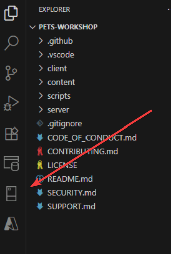
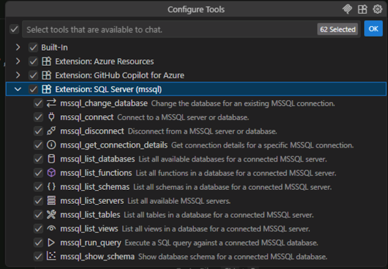
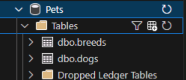

# Working with SQL Server Using GitHub Copilot

GitHub Copilot for the MSSQL extension brings AI-powered assistance directly into your SQL development workflow within Visual Studio Code. This integration enables developers to work more efficiently with SQL Server, Azure SQL, and Microsoft Fabric databases by:

- **Writing and optimizing queries** - Generate SQL queries from natural language descriptions and receive AI-recommended improvements for performance
- **Exploring and designing schemas** - Understand, design, and evolve database schemas using intelligent, code-first guidance with contextual suggestions for relationships and constraints
- **Understanding existing code** - Get natural language explanations of stored procedures, views, and functions to help you understand business logic quickly
- **Generating test data** - Create realistic, schema-aware sample data to support testing and development environments
- **Analyzing security** - Receive recommendations to avoid SQL injection, excessive permissions, and other security vulnerabilities
- **Accelerating development** - Scaffold backend components and data access layers based on your database context

This powerful combination allows you to focus on solving problems rather than memorizing SQL syntax, making database development more intuitive and productive.

## Scenario

Now that your application supports multiple database systems including SQL Server, you want to explore how GitHub Copilot can help you interact with your SQL Server database directly from VS Code. You'll use the GitHub Copilot for MSSQL extension to generate queries and explore your data using natural language.

## Prerequisites

Good news! We've already set up everything you need for this exercise:

- SQL Server Express is installed and running locally 
  - With pets database populated with data
- The **GitHub Copilot for MSSQL** extension is installed in VS Code
- A SQL Server connection has been pre-registered in your environment

You're ready to connect and start querying right away!

## Understanding GitHub Copilot for MSSQL

The GitHub Copilot for MSSQL extension brings AI-powered assistance to your database work. It can:

- Generate SQL queries from natural language descriptions
- Explain existing queries in plain English
- Suggest query optimizations and best practices
- Help explore database schemas and relationships
- Convert natural language questions into executable SQL

This integration makes working with databases more intuitive, especially when you're exploring unfamiliar schemas or need to write complex queries quickly.

## Connect to SQL Server

First, let's establish a connection to your SQL Server instance.

1. []  Open the **SQL Server** view by clicking on the SQL Server icon in the Activity Bar (left sidebar).
  - 
2. []  For your convenience we have already registered **LocalServer** for you.
3. []  Expand **LocalServer** and you should see **Databases**, **Security** and **Server Objects** nodes as a tree. Expand the **Databases** node to see the **PetsDB** database.

## Optional: Create database

> [!NOTE]
> We've already provided a pre-seeded **PetsDB** database for you. This section is optional if you want to practice creating a database from scratch using Copilot's inline mode. 

If you want to create your own database:

1. []  In the SQL Server view, right-click on your server connection and select **New Query**.
2. []  Press <kbd>Control</kbd>+<kbd>I</kbd> to open Copilot inline chat in the query editor.
3. []  Type the following prompt:

    ```text
    Create a Sql server database called Pets with recovery mode set to simple
    ```

4. []  Review the generated SQL and click **Accept** the suggestion if it feels right. It should be very similar to this:

    ```sql-nocopy
    CREATE DATABASE Pets;
    ALTER DATABASE Pets SET RECOVERY SIMPLE;
    ```
    
5. []  Execute the query by clicking **Run** or pressing <kbd>Control</kbd>+<kbd>Shift</kbd>+<kbd>E</kbd>.
6. []  Refresh the SQL Server view to see your new **Pets** database.

Typically we would now seed the just created database by calling the **seed-database.ps1** (or **seed-database.sh** on Linux/Mac), but let's skip this so we are not distracted by non-Copilot activities.

## Query the database using natural language using agent mode

Now let's use GitHub Copilot to query our database using natural language. This is where the power of AI-assisted SQL really shines!

1. []  Open GitHub Copilot Chat if it's not already open and start a new chat by clicking the **+** button and make sure you are in **Agent** mode.
2. []  Select **GPT-4.1** from the list of available models.
3. []  Click on the tools icon on the bottom left corner of the chat window, this will open the **Configure Tools** window.
4. []  Scroll down and expand the **Extension: SQL Server (mssql)** 
   
5. []  Review the tool descriptions. These tools are external services or functions that Copilot can interact with to perform specific tasks, such as retrieving data, running code, or managing resources. By calling these tools, Copilot can provide more accurate, up-to-date, and context-aware assistance, going beyond its built-in knowledge to deliver tailored solutions for your needs.
6. []  Dismiss the window by clicking **OK**.
7. []  Let's execute our first prompt in the chat window:

    ```text
    connect to the PetsDB database using my LocalServer profile name
    ```
8. []  Copilot is going to ask our permission to execute **mssql: List Connections tool**. Every time Copilot needs to execute something, it will ask your permission. In this case let's click on the dropdown selector and pick **Always allow**. This will add this tool to the auto-approve list; in the future if Copilot wants to run this tool, you will not be asked for confirmation.
   
9. []  Now it will ask to connect to the server, select **Always Allow** as well.
10. []  We are now connected to the database. Let's see what tables the database has by running the prompt (click allow on tool execution confirmation):
    ```text
    show me the list of tables
    ```
    You should see two tables: **dogs** and **breeds**.
    
11. []  Now we know our database has two tables, so let's understand the schema by running the prompt:
    ```text
    show me the schema
    ```
    The schema designer will open, showing the structure of the database, including tables, columns, and relationships. This is possible because tool calling allows interaction with the extension itself.
    
12. []  Great, we are now ready to run a query on our **PetsDB** database. Use the prompt in the chat window:

   ```text
   How many "Golden Retrievers" do we have available for adoption in the Database?
   ```
13. [] When asked permission to run **mssql: Run query**, before allowing it, click on the **show more** to preview the SQL statement Copilot wants to execute to see that it was able to join tables and set the right predicates to count the number of Golden Retrievers, if you click again on the show more you can see the inputs that will be passed to the tool (**connectionId** and **query**). When a tool is executed you can always see the inputs and if you choose to execute it the output as well. The query should be similar to:

    ```sql-nocopy
    SELECT COUNT(*) as available_golden_retrievers
    FROM dogs d
    JOIN breeds b ON d.breed_id = b.id
    WHERE b.name = 'Golden Retriever'
    AND d.available = 'Available';
    ```

14. [] Click Allow to execute the query. Copilot will tell how many golden retrievers are available for adoption.

> [!TIP]
> Notice how Copilot understands the context of your database and generates a SQL query that:
> - Joins the necessary tables (dogs and breeds)
> - Filters by breed name
> - Filters by availability status
> - Counts the results

> [!TIP]
> To avoid repeated approval prompts, you can configure auto-approval for tools and commands. Use the `chat.tools.autoApprove` setting to enable automatic approval per workspace, or set it globally for all workspaces. Be aware of the [security implications][copilot-tools-auto-approve] before enabling this feature, but you have control which tools you want to auto-approve.

> [!IMPORTANT]
> Because LLMs are probabilistic, not deterministic, the exact SQL generated can vary. The query should accomplish the same goal even if the syntax differs slightly.

## Exercise: Explore more queries (optional)

If you want to get some ideas about some more complex queries that Copilot can generate, try asking Copilot these questions:

1. []  **Find all available dogs with their breed names**: Ask Copilot to generate a query that shows dog names, ages, and breed names for all dogs that are available for adoption.

    > [!Hint]
    > Try a prompt like: "Show me all available dogs with their names, ages, and breed names"

2. []  **Group dogs by breed**: Ask Copilot to count how many dogs of each breed are in the database.

    > [!Hint]
    > Try: "Count the number of dogs for each breed and show the breed name"

3. []  **Find the oldest dog**: Ask Copilot to find the name and age of the oldest dog in the shelter.

    > [!Hint]
    > Try: "Find the oldest dog in the database"

4. []  **Complex filtering**: Ask Copilot to find all available dogs that are younger than 5 years old, grouped by breed.

    > [!Hint]
    > Try: "Show me available dogs younger than 5 years old, grouped by breed with counts"

## Understanding query explanations

Copilot can also help you understand existing SQL queries. This is incredibly useful when working with complex queries or legacy code.

1. []  Copy a complex query from your previous exercises into the query editor.

2. []  Select the entire query. (or you can use this one):
    ```sql
    SELECT b.name AS BreedName, COUNT(d.id) AS DogCount
    FROM dbo.dogs d    
        JOIN dbo.breeds b ON d.breed_id = b.id
    WHERE d.status = 'available' AND d.age < 5
    GROUP BY b.name
    ORDER BY DogCount DESC;
    ```
3. []  In Copilot inline Chat, type `/explain` and press <kbd>Enter</kbd>.
4. []  Read through Copilot's explanation of what the query does, including details about joins, filters, and aggregations.

> [!TIP]
> If the text is too big and hard to read because of the scrolling, click on **View Chat** to see the explanation in the chat panel.

> [!NOTE]
> This feature is particularly helpful when inheriting code from other developers or when returning to queries you wrote months ago.

## Exercise: Generate test data with the @mssql chat participant

GitHub Copilot can help you generate realistic test and mock data for your database. This is especially useful when you need to test your application with meaningful data, create demos, or simulate edge cases. Let's use the **@mssql** chat participant to generate test data.

> [!NOTE]
> The **@mssql** chat participant is specifically designed for SQL Server operations and requires an active database connection to understand your schema context.

Before starting, type in the chat window `@mssql /` to see the available slash commands the **@mssql** chat participant offers.

### Generate edge case test data

Testing edge cases is crucial for building robust applications. Let's generate data to test boundary conditions or uncover other issues our code might have with odd data shapes.

1. []  Open GitHub Copilot Chat and start a new chat by clicking the **+** button.
2. []  Ask Copilot to generate edge case data:

    ```text
    @mssql Generate insert statements for the dogs table to test edge cases. Include:
    - A dog with age 0 (newborn puppy)
    - A dog with age 20 (very old)
    - Dogs with very short names (1-2 characters)
    - Dogs with longer names (15+ characters)
    - Other edge case variations you can think of
    All should reference valid breed IDs.
    ```
    Note: Don't use the type feature, use copy to clipboard and paste instead to avoid partial generations due to new lines.

3. []  Review the generated SQL to see how Copilot handles these edge cases.
4. []  Execute the statements.

> [!IMPORTANT]
> Edge case testing helps you discover potential issues before they affect real users. Pay attention to how your UI displays very long names, ages at boundaries, etc.

## Summary and next steps

You've successfully used GitHub Copilot with the MSSQL extension to interact with SQL Server using natural language! You learned how to:

- Connect to SQL Server from VS Code
- Generate SQL queries from natural language questions
- Execute and validate query results
- Use Copilot to explore and understand database queries

This integration dramatically reduces the friction of working with databases, allowing you to focus on the questions you want to answer rather than the syntax required to answer them.

## What's next?

Continue exploring more advanced Copilot capabilities:

- Using GitHub Copilot for Azure - Learn how to interact with Azure resources directly from VS Code

## Resources

- [GitHub Copilot for MSSQL documentation][copilot-mssql]
- [SQL Server extension for VS Code][mssql-extension]
- [Quickstart: Use GitHub Copilot Agent Mode (Preview)][mssql-extension-agent-mode-quickstart]
- [Quickstart: Generate data for testing and mocking (Preview)][mssql-extension-data-testing-mocking-quickstart]
- [Writing queries with GitHub Copilot][copilot-sql-guide]
- [SQL Server T-SQL reference][tsql-reference]

[copilot-mssql]: https://learn.microsoft.com/en-us/sql/tools/visual-studio-code-extensions/github-copilot/overview?view=sql-server-ver17
[mssql-extension]: https://marketplace.visualstudio.com/items?itemName=ms-mssql.mssql
[mssql-extension-agent-mode-quickstart]: https://learn.microsoft.com/en-us/sql/tools/visual-studio-code-extensions/github-copilot/agent-mode?view=sql-server-ver17
[mssql-extension-data-testing-mocking-quickstart]: https://learn.microsoft.com/en-us/sql/tools/visual-studio-code-extensions/github-copilot/test-and-mocking-data-generator?view=sql-server-ver17
[copilot-sql-guide]: https://code.visualstudio.com/docs/copilot/copilot-chat
[tsql-reference]: https://docs.microsoft.com/en-us/sql/t-sql/language-reference
[copilot-tools-auto-approve]: https://code.visualstudio.com/docs/copilot/chat/chat-agent-mode#_autoapprove-all-tools-and-commands
