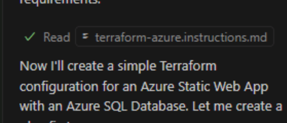
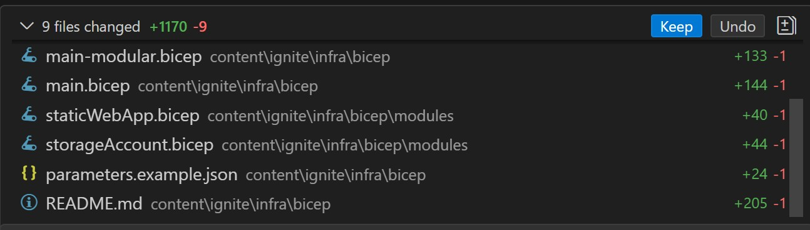

# Accelerating Infrastructure as Code (IaC) with GitHub Copilot

Infrastructure as Code (IaC) lets teams define, provision, and manage cloud infrastructure using code. This brings the benefits of version control, automation, and repeatability to infrastructure management.

Tools like [Terraform][terraform-docs] and [Bicep][bicep-docs] make it easier to describe and deploy cloud resources declaratively. However, writing and maintaining IaC files can still take time and may be prone to errors.

This is where GitHub Copilot excels.

## Why Use GitHub Copilot for IaC?

GitHub Copilot helps you write, refactor, and understand IaC templates quickly. Using natural language prompts and contextual awareness, Copilot can:

- **Generate infrastructure templates from plain language descriptions** — For example, describe a resource you need, such as “create an Azure storage account with a private endpoint,” and Copilot will suggest the Terraform or Bicep code to do it.
- **Reduce syntax errors and boilerplate code** — Copilot understands the structure and schema of Terraform and Bicep resources, minimizing typos and repetitive declarations.
- **Speed up resource creation** — Copilot quickly scaffolds configurations, including providers, variables, modules, and outputs.
- **Improve readability and maintainability** — Copilot can add comments, generate variable documentation, and suggest consistent naming conventions.
- **Support learning and experimentation** — You can explore and refine configurations interactively instead of memorizing every resource property.

GitHub Copilot doesn’t replace your understanding of Terraform or Bicep. Instead, it enhances your workflow—reducing friction and helping you focus on design and intent, not just syntax.

## Scenario

The Tailspin Shelter application includes a database, a website, and an API backend. Though everything is currently hosted locally in your repository, you want to deploy to Azure using an automated process for Infrastructure as Code(IaC). This reduces human error in deployments and introduces continuous integration and continuous deployment (CI/CD) practices.

In this workshop, you will learn how to work with GitHub Copilot to write, modify and test scripts in either Terraform or Bicep, it's your choice! If you're feeling brave, you can complete both sections!

> [!NOTE]
> The same workflow can be applied to other cloud providers. Copilot can also suggest Terraform code for AWS, GCP, and more.

## Prerequisites

Everything you need for this exercise is already set up:

- GitHub Copilot
- [HashiCorp Terraform extension for VSCode][vs-code-tf] (**.tf** files)
- [Bicep extension for VSCode][vs-code-bicep] (**.bicep** files)
- GitHub Copilot instruction files for Terraform Azure instructions and Bicep code best practices

> [!IMPORTANT]
> Large Language Models (LLMs) are probabilistic, not deterministic. This means that each time you run this lab, you may see different results:
> - The exact code structure and implementation details may vary
> - The agent may take different approaches to solve the same problem
> - File organization and naming conventions might differ
> - The sequence of steps and tool usage could change
> 
> This is normal and expected behavior. Different models (like Claude Sonnet 4.5 vs. GPT-4) may also produce different outputs. What matters is that the generated code achieves the intended functionality. Review all generated code carefully and iterate as needed to match your requirements.

Start below to follow the Terraform learning path. To follow the Bicep learning path, scroll down to the **Prompting Bicep with Copilot** section.

> [!NOTE] 
> Terraform and Bicep exercises are the same, they just use different IaC tools. Choose the one you prefer, or complete both if you have time! 

## Prompting Terraform with Copilot

Once your environment is ready, let’s use GitHub Copilot to create your first Terraform configuration file.

Terraform lets you define infrastructure declaratively—specifying what you want, not how to build it. Copilot enhances this by suggesting Terraform code right in your editor, driven by your descriptions.

In this scenario, you will create a Terraform configuration file with Copilot, and then generate a deployment workflow.

1. []  Close any tabs you may have open in your VS Code to ensure Copilot has a clean context.
2. []  Open or switch to GitHub Copilot Chat if it's not already open.
3. []  Switch to Agent mode by clicking on the chat mode dropdown at the bottom of the Chat view and selecting **Agent**.
    - If asked **Changing the chat mode will end your current session. Would you like to continue?** click **Yes**
    - If you were already in Agent mode, press **+** to start a new session.
4. []  Select **Claude Sonnet 4.5** from the list of available models.
5. []  Send the following prompt to the agent:
   `Create a simple Terraform configuration for an Azure Static webapp with an Azure SQL Database`
6. Copilot may decide to execute tools to do a better job. If it does, examine the request being made and **Allow** it. For example it may ask to run **azureterraformbestpractices** from **Azure MCP server**
7. [] It will also read the instructions file specific for Terraform, which you can see the chat results as **Read terraform-azure.instructions.md**, click on the file or open it from the **.github/instructions** folder and take a look at it while Copilot is working.
  
9. [] Copilot might try validate the created **.tf** file with **terraform** CLI. The tool is not installed (intentionally) so not only you can observe that the Agent may decide to use tools (**Allow** the execution) to validate it's own code and in this case ask permission to install it after it tries to run **terraform** and realized the execution failed because it is not installed. Click on **Skip**, the agent will adapt on the absence of the tool.

  

9. When the execution has finished, see the list of files changes. You should see a **main.tf**, along with corresponding variables and outputs files. Be sure to review the generated code carefully — iteration and refinement are essential when working with Copilot’s output and then click on **keep**
10. []**Create Reusable Infrastructure**
   Next, make your infrastructure reusable and scalable for Azure by asking Copilot:
   `Generate a Terraform module for the static site and storage account so it can be used in multiple environments`
11. If Copilot tries to execute tools, review the ask and **Allow** them.
   Copilot will often generate several files and environment setups. Take time to review them and refine the output — iterative improvement is an essential part of the process.
12. []**Generate a Deployment Workflow**
   Since Copilot has suggested multiple environments, create a deployment pipeline in GitHub by asking:
   `Create a GitHub deployment YAML workflow to deploy to Azure.`
   Copilot will generate a multi-step YAML workflow you can use.

13.  **Next Steps**
   - Iterate on the output to match your environment.
   - Add tests to your Terraform code (recommended).
   - Ask Copilot to review your code for security.

By combining GitHub Copilot with Terraform, you’ve seen how AI can accelerate infrastructure-as-code development while maintaining flexibility and control. You now have a foundation for deploying and managing scalable, repeatable environments all powered by intelligent code generation. Continue refining your prompts, expanding your instruction files, and iterating on Copilot’s output to make it a true extension of your team’s DevOps workflow. With these practices in place, your cloud deployments will become faster, more consistent, and easier to manage over time.

Scroll below to complete the Working with Bicep Module, or proceed to the next lab

## Prompting Bicep with Copilot

Bicep is a domain-specific language (DSL) for deploying Azure resources declaratively. It makes Infrastructure as Code easier to write, read, and maintain by simplifying the syntax used in traditional ARM templates. With Bicep, you can define your infrastructure using clean, modular code that integrates seamlessly with Azure.

When used with GitHub Copilot, Bicep authoring becomes faster and smarter—Copilot can generate, explain, and refine your Bicep templates from simple natural-language prompts, helping you focus on architecture and best practices instead of syntax.

In this scenario, you will create an initial Bicep file with Copilot and then generate a deployment workflow.

### Steps

1. []  Close any tabs you may have open in your VS Code to ensure Copilot has a clean context.
2. []  Open or switch to GitHub Copilot Chat if it's not already open.
3. []  Switch to Agent mode by clicking on the chat mode dropdown at the bottom of the Chat view and selecting **Agent**.
    - If asked **Changing the chat mode will end your current session. Would you like to continue?** click **Yes**
    - If you were already in Agent mode, press **+** to start a new session.
4. []  Select **Claude Sonnet 4.5** from the list of available models.
5. []  Send the following prompt to the agent:
   `Create a simple Bicep configuration for an Azure Static webapp with an Azure SQL Database`
6. [] Copilot may decide to execute tools to do a better job. If it does, examine the request being made and **Allow** it. For example it may ask to run **get_bestpractices** from **Azure MCP server**.
7. [] If asked to **Allow MCP tools from "Azure MCP" to make LLM requests?" click on **Always**

  Observe the process. Copilot output, the actions it is taking and the files it is reading,etc. When it is finished it will generate a **main.bicep** file, along with corresponding variables and outputs files.

  

  You can view the files in your IDE by expanding the **X files changes** and choose to keep them, undo the changes, or modify. Be sure to review the generated code carefully — iteration and refinement are essential when working with Copilot’s output.
   - Add additional security features
   - Optimize the configuration for cost
   - Add more environment-specific configurations
8. [] Click on **Keep**

9. []**Create Reusable Infrastructure**
   Next, make your infrastructure reusable and scalable for Azure by asking Copilot:
   `Generate a Bicep module for the static site and storage account so it can be used in multiple environments.`

   Copilot will often generate several files and environment setups. Take time to review them and refine the output — iterative improvement is an essential part of the process.

10. []**Generate a Deployment Workflow**
   Since Copilot has suggested multiple environments, create a deployment pipeline in GitHub by asking:
   `Create a GitHub Actions deployment YAML workflow to deploy to Azure.`
   Copilot will generate a multi-step YAML workflow you can use, if asked to allow execution of tools, **allow** it.

11.  **Next Steps**
   - Iterate on the output to match your environment.
   - Add tests to your Bicep code (recommended).
   - Ask Copilot to review your code for security.

By combining GitHub Copilot with Bicep, you've experienced how AI can accelerate Azure-native infrastructure development while preserving clarity, modularity, and control. You now have a foundation for deploying and managing a complete environment — including a web app, API, and database — using clean, reusable Bicep templates. Continue refining your prompts and expanding your Copilot instruction files to reflect your team's standards and architecture patterns. As you iterate, Copilot becomes an even more capable assistant, helping you build consistent, secure, and scalable Azure deployments with less effort and greater confidence.

## Resources

### Infrastructure as Code Documentation

- [Terraform Documentation][terraform-docs]
- [Terraform Azure Provider][terraform-azure-provider]
- [Azure Bicep Documentation][bicep-docs]
- [Bicep Best Practices][bicep-best-practices]

### GitHub Copilot Resources

- [Copilot Instruction Files][copilot-instructions]
- [Awesome Copilot - Curated list of resources, tools, and best practices][awesome-copilot]

### CI/CD and GitHub Actions

- [GitHub Actions Documentation][github-actions-docs]
- [GitHub Actions for Azure][github-actions-azure]
- [Terraform GitHub Actions][terraform-github-actions]
- [Deploy Bicep with GitHub Actions][bicep-github-actions]

[terraform-docs]: https://www.terraform.io/docs
[terraform-azure-provider]: https://registry.terraform.io/providers/hashicorp/azurerm/latest/docs
[bicep-docs]: https://learn.microsoft.com/azure/azure-resource-manager/bicep/
[bicep-best-practices]: https://learn.microsoft.com/azure/azure-resource-manager/bicep/best-practices
[vs-code-bicep]: https://marketplace.visualstudio.com/items?itemName=ms-azuretools.vscode-bicep
[vs-code-tf]: https://marketplace.visualstudio.com/items?itemName=HashiCorp.terraform
[copilot-docs]: https://docs.github.com/copilot
[copilot-agent-mode]: https://code.visualstudio.com/docs/copilot/chat/chat-agent-mode
[copilot-instructions]: https://docs.github.com/en/copilot/customizing-copilot/adding-repository-custom-instructions-for-github-copilot
[awesome-copilot]: https://github.com/github/awesome-copilot
[github-actions-docs]: https://docs.github.com/actions
[github-actions-azure]: https://github.com/Azure/actions
[terraform-github-actions]: https://github.com/hashicorp/setup-terraform
[bicep-github-actions]: https://learn.microsoft.com/azure/azure-resource-manager/bicep/deploy-github-actions