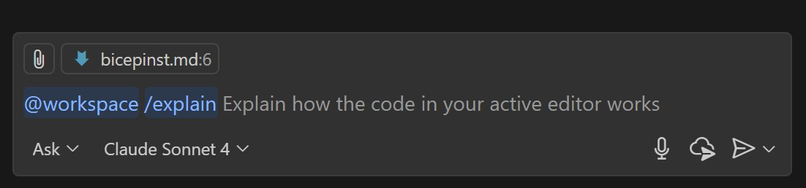

# Accelerating Infrastructure as Code (IaC) with GitHub Copilot

# Working with Terraform Using GitHub Copilot

## Learning Objectives
By the end of this workshop, you will:
- Use GitHub Copilot to generate Terraform configuration files
- Create reusable Terraform modules with Copilot assistance  
- Generate GitHub Actions workflows for CI/CD deployment
- Configure Copilot instruction files for better context

Infrastructure as Code (IaC) lets teams define, provision, and manage cloud infrastructure using code. This brings the benefits of version control, automation, and repeatability to infrastructure management.

Tools like Terraform and Bicep make it easier to describe and deploy cloud resources declaratively. However, writing and maintaining IaC files can still take time and may be prone to errors.

This is where GitHub Copilot excels.

## Why Use GitHub Copilot for IaC?

GitHub Copilot helps you write, refactor, and understand IaC templates quickly. Using natural language prompts and contextual awareness, Copilot can:

- **Generate infrastructure templates from plain language descriptions** — For example, describe a resource you need, such as “create an Azure storage account with a private endpoint,” and Copilot will suggest the Terraform or Bicep code to do it.
- **Reduce syntax errors and boilerplate code** — Copilot understands the structure and schema of Terraform and Bicep resources, minimizing typos and repetitive declarations.
- **Speed up resource creation** — Copilot quickly scaffolds configurations, including providers, variables, modules, and outputs.
- **Improve readability and maintainability** — Copilot can add comments, generate variable documentation, and suggest consistent naming conventions.
- **Support learning and experimentation** — You can explore and refine configurations interactively instead of memorizing every resource property.

GitHub Copilot doesn’t replace your understanding of Terraform or Bicep. Instead, it enhances your workflow—reducing friction and helping you focus on design and intent, not just syntax.

## Scenario

Your application includes a database, a website, and an API. Though everything is currently hosted locally in your repository, you want to deploy to Azure using an automated process for Infrastructure as Code. This reduces human error in deployments and introduces continuous integration and continuous delivery (CI/CD) practices. 

In this workshop, you will create either a Bicep or Terraform configuration file and a GitHub Actions workflow to deploy to Azure. Choose which technology you prefer and follow the relevant section below.

> **Note:** The same workflow can be applied to other cloud providers. Copilot can also suggest Terraform code for AWS, GCP, and more.

## Prerequisites

Everything you need for this exercise is already set up:

- GitHub Copilot enabled in your IDE  
- HashiCorp Terraform extension for VSCode (`.tf` files)  
- Bicep extension for VSCode (`.bicep` files)  

Start below to follow the Terraform learning path. To follow the Bicep learning path, [click here](#working-with-bicep-using-gitHub-copilot).

## Prompting Terraform with Copilot

Once your environment is ready, let’s use GitHub Copilot to create your first Terraform configuration file.

Terraform lets you define infrastructure declaratively—specifying what you want, not how to build it. Copilot enhances this by suggesting Terraform code right in your editor, driven by your descriptions.

In this scenario, you will create a Terraform configuration file with Copilot, and then generate a deployment workflow.

1. []**Open VSCode.**
2. []**Open Copilot Chat** by clicking the Copilot icon in the VSCode top bar.  
   
   Prompt Copilot:
   “Create a Terraform configuration for an Azure Static webapp with an Azure SQL Database”  
  
  Copilot will generate a main.tf file, along with corresponding variables and outputs files. Be sure to review the generated code carefully — iteration and refinement are essential when working with Copilot’s output.
3. []**Learn Slash Commands**  
   In Copilot Chat, use slash commands for frequent tasks. Type `/` to view available commands, or check the [GitHub Copilot Chat cheat sheet](https://docs.github.com/copilot/reference/github-copilot-chat-cheat-sheet#slash-commands) for details.

   Some useful examples are:
   - `/doc` — Add a documentation comment  
   - `/explain` — Explain your code  
   - `/fix` — Propose a fix  
   - `/generate` — Create code as needed  

   Type `/explain` to get an in-depth explanation of the generated code. This is helpful for learning about existing files and new projects.

   

4. []**Create Reusable Infrastructure**  
   Next, make your infrastructure reusable and scalable for Azure by asking Copilot:  
   “Generate a Terraform module for the static site and storage account so it can be used in multiple environments.”  
   Copilot will often generate several files and environment setups. Take time to review them and refine the output — iterative improvement is an essential part of the process.

5. []**Generate a Deployment Workflow**  
   Since Copilot has suggested multiple environments, create a deployment pipeline in GitHub by asking:  
   “Create a deployment YAML workflow to deploy to Azure.”  
   Copilot will generate a multi-step YAML workflow you can use.

```YAML
name: Deploy Infrastructure with Terraform

on:
  push:
    branches: [main]
    paths:
      - 'content/ignite/infra/terraform/**'
  workflow_dispatch:
    inputs:
      action:
        description: 'Action to perform'
        required: true
        default: 'plan'
        type: choice
        options:
          - plan
          - apply
          - destroy

env:
  ARM_CLIENT_ID: ${{ secrets.AZURE_CLIENT_ID }}
  ARM_CLIENT_SECRET: ${{ secrets.AZURE_CLIENT_SECRET }}
  ARM_SUBSCRIPTION_ID: ${{ secrets.AZURE_SUBSCRIPTION_ID }}
  ARM_TENANT_ID: ${{ secrets.AZURE_TENANT_ID }}

jobs:
  terraform:
    name: Terraform
    runs-on: ubuntu-latest
    defaults:
      run:
        working-directory: ./content/ignite/infra/terraform
    
    steps:
    - name: Checkout
      uses: actions/checkout@v4

    - name: Setup Terraform
      uses: hashicorp/setup-terraform@v3
      with:
        terraform_version: '1.5.0'

    - name: Terraform Init
      run: terraform init

    - name: Terraform Plan
      if: github.event.inputs.action != 'destroy'
      run: terraform plan -out=tfplan

    - name: Terraform Apply
      if: github.event.inputs.action == 'apply' || github.ref == 'refs/heads/main'
      run: terraform apply -auto-approve tfplan

    - name: Terraform Destroy
      if: github.event.inputs.action == 'destroy'
      run: terraform destroy -auto-approve

    - name: Get Outputs
      if: github.event.inputs.action == 'apply' || github.ref == 'refs/heads/main'
      run: |
        echo "Website URL: $(terraform output -raw static_website_url)"
        echo "Storage Account: $(terraform output -raw storage_account_name)"

  deploy-website:
    name: Deploy Website
    runs-on: ubuntu-latest
    needs: terraform
    if: github.event.inputs.action == 'apply' || github.ref == 'refs/heads/main'
    
    steps:
    - name: Checkout
      uses: actions/checkout@v4

    - name: Build Website
      working-directory: ./client
      run: |
        npm ci
        npm run build

    - name: Azure Login
      uses: azure/login@v1
      with:
        client-id: ${{ secrets.AZURE_CLIENT_ID }}
        tenant-id: ${{ secrets.AZURE_TENANT_ID }}
        subscription-id: ${{ secrets.AZURE_SUBSCRIPTION_ID }}

    - name: Deploy to Storage
      run: |
        # Get storage account name from Terraform output
        cd content/ignite/infra/terraform
        STORAGE_NAME=$(terraform output -raw storage_account_name)
        
        # Upload files
        az storage blob upload-batch \
          --account-name $STORAGE_NAME \
          --destination '$web' \
          --source ./client/dist \
          --auth-mode login \
          --overwrite
```

6.  **Next Steps**
   - Iterate on the output to match your environment.  
   - Add tests to your Terraform code (recommended).  
   - Ask Copilot to review your code for security.
    
7. The output in this lab is a great starting point, but to improve the output of Copilot, it's critical that we improve the amount of context that it is given. One of the best ways to do this is by using an instructions file:

GitHub Copilot instruction files are Markdown documents that give Copilot the context it needs to understand your Terraform project. These files help Copilot generate code that aligns with your team’s standards, naming conventions, and infrastructure patterns.

There are two types of instruction files:

- **Global instructions** — Apply to the whole repository and are stored in `copilot-instructions.md`.  
- **Scoped instructions** — Apply to specific folders or modules and are stored in `.github/instructions/*instructions.md`.  

By adding clear context—such as preferred Terraform module structures, naming rules, backend configurations, or resource tagging strategies—you help Copilot suggest code that fits seamlessly into your workflows. For instance, Copilot can generate Terraform modules that follow your variable naming patterns, use your standard providers, or include required tags and outputs automatically.

These instruction files also improve collaboration. New contributors get consistent, project-aligned suggestions without heavy onboarding, and your team benefits from more uniform, readable code across environments.

With well-written instructions, Copilot becomes a project-aware Terraform assistant that writes, updates, and refactors your IaC with your team’s practices in mind.

Let's create our first global custom instructions file!

8. []**Create** a new file named `copilot-instructions.md` inside the `.github` directory.
9. []**Ask Copilot:**  
   “Create a global instructions file for using Terraform.”  
   Review the output—it should include general practices, naming conventions, required providers, and module development guidance. Use it as a starting point and customize it to your team’s standards.
10. []**Enhance Context with Scoped Files**  
   You can also create scoped instruction files that apply only to specific directories or modules.  
   - Create a subdirectory `.github/instructions`.  
   - Save scoped instruction files with a `terraform.instructions.md` extension inside this folder.

Your output from Copilot will improve significantly as it gains more context about your project. Give it a try!

________________________________________________________________________________________________________________________________________________________________________

# Working with Bicep Using GitHub Copilot

## Learning Objectives

By the end of this workshop, you will:

- Use GitHub Copilot to generate Bicep configuration files
- Create reusable Bicep modules with Copilot assistance  
- Generate GitHub Actions workflows for CI/CD deployment
- Configure Copilot instruction files for better context

## Prompting Bicep with Copilot

Bicep is a domain-specific language (DSL) for deploying Azure resources declaratively. It makes Infrastructure as Code easier to write, read, and maintain by simplifying the syntax used in traditional ARM templates. With Bicep, you can define your infrastructure using clean, modular code that integrates seamlessly with Azure.

When used with GitHub Copilot, Bicep authoring becomes faster and smarter—Copilot can generate, explain, and refine your Bicep templates from simple natural-language prompts, helping you focus on architecture and best practices instead of syntax.

In this scenario, you will create an initial Bicep file with Copilot and then generate a deployment workflow.

### Steps

1. []**Open VSCode.**
2. []**Open Copilot Chat** by clicking the Copilot icon in the VSCode top bar.  
   
   Prompt Copilot:
   “Create a Bicep configuration for an Azure Static webapp with an Azure SQL Database”  
  
  Copilot will generate a `main.bicep` file, along with corresponding variables and outputs files. Be sure to review the generated code carefully — iteration and refinement are essential when working with Copilot’s output.

3. []**Learn Slash Commands**  
   In Copilot Chat, use slash commands for frequent tasks. Type `/` to view available commands, or check the [GitHub Copilot Chat cheat sheet](https://docs.github.com/copilot/reference/github-copilot-chat-cheat-sheet#slash-commands) for details.

   Some useful examples are:
   - `/doc` — Add a documentation comment  
   - `/explain` — Explain your code  
   - `/fix` — Propose a fix  
   - `/generate` — Create code as needed  

   Type `/explain` to get an in-depth explanation of the generated code. This is helpful for learning about existing files and new projects.

   

4. []**Create Reusable Infrastructure**  
   Next, make your infrastructure reusable and scalable for Azure by asking Copilot:  
   “Generate a Bicep module for the static site and storage account so it can be used in multiple environments.”  
   Copilot will often generate several files and environment setups. Take time to review them and refine the output — iterative improvement is an essential part of the process. 

5. []**Generate a Deployment Workflow**  
   Since Copilot has suggested multiple environments, create a deployment pipeline in GitHub by asking:  
   “Create a deployment YAML workflow to deploy to Azure.”  
   Copilot will generate a multi-step YAML workflow you can use.

```YAML
name: Deploy Infrastructure with Bicep

name: Basic Deploy

on:
  push:
    branches: [ main ]
  workflow_dispatch:

env:
  RESOURCE_GROUP: rg-petstore
  LOCATION: "East US 2"

jobs:
  deploy:
    runs-on: ubuntu-latest
    steps:
      - uses: actions/checkout@v4
      
      - name: Azure Login
        uses: azure/login@v1
        with:
          client-id: ${{ secrets.AZURE_CLIENT_ID }}
          tenant-id: ${{ secrets.AZURE_TENANT_ID }}
          subscription-id: ${{ secrets.AZURE_SUBSCRIPTION_ID }}

      - name: Deploy
        working-directory: ./content/ignite/infra/bicep
        run: |
          # Create resource group
          az group create --name $RESOURCE_GROUP --location "$LOCATION"
          
          # Deploy infrastructure
          az deployment group create \
            --resource-group $RESOURCE_GROUP \
            --template-file main.bicep \
            --parameters environmentName=prod
          
          # Build website
          cd ../../../../client
          npm ci && npm run build
          
          # Get storage account and deploy
          storage=$(az storage account list -g $RESOURCE_GROUP --query "[0].name" -o tsv)
          az storage blob upload-batch \
            --account-name $storage \
            --destination '$web' \
            --source dist \
            --auth-mode login \
            --overwrite
          
          # Show URL
          az storage account show \
            --name $storage \
            --resource-group $RESOURCE_GROUP \
            --query "primaryEndpoints.web" -o tsv
```
6.  **Next Steps**
   - Iterate on the output to match your environment.  
   - Add tests to your Terraform code (recommended).  
   - Ask Copilot to review your code for security.
    
7. The output in this lab is a great starting point, but to improve the output of Copilot, it's critical that we improve the amount of context that it is given. One of the best ways to do this is by using an instructions file:

GitHub Copilot instruction files are Markdown documents that give Copilot the context it needs to understand your Bicep project. These files help Copilot generate code that aligns with your team’s standards, naming conventions, and infrastructure patterns.

There are two types of instruction files:

- **Global instructions** — Apply to the whole repository and are stored in `copilot-instructions.md`.  
- **Scoped instructions** — Apply to specific folders or modules and are stored in `.github/instructions/*instructions.md`.  

By adding clear context—such as preferred Bicep module structures, naming rules, backend configurations, or resource tagging strategies—you help Copilot suggest code that fits seamlessly into your workflows. For instance, Copilot can generate Bicep modules that follow your variable naming patterns, use your standard providers, or include required tags and outputs automatically.

These instruction files also improve collaboration. New contributors get consistent, project-aligned suggestions without heavy onboarding, and your team benefits from more uniform, readable code across environments.

With well-written instructions, Copilot becomes a project-aware Bicep assistant that writes, updates, and refactors your IaC with your team’s practices in mind.

Let's create our first global custom instructions file!

8. []**Create** a new file named `copilot-instructions.md` inside the `.github` directory.
9. []**Ask Copilot:**  
   “Create a global instructions file for using Bicep.”  
   Review the output—it should include general practices, naming conventions, required providers, and module development guidance. Use it as a starting point and customize it to your team’s standards.
10. []**Enhance Context with Scoped Files**  
   You can also create scoped instruction files that apply only to specific directories or modules.  
   - Create a subdirectory `.github/instructions`.  
   - Save scoped instruction files with a `bicep.instructions.md` extension inside this folder.

Your output from Copilot will improve significantly as it gains more context about your project. Give it a try!