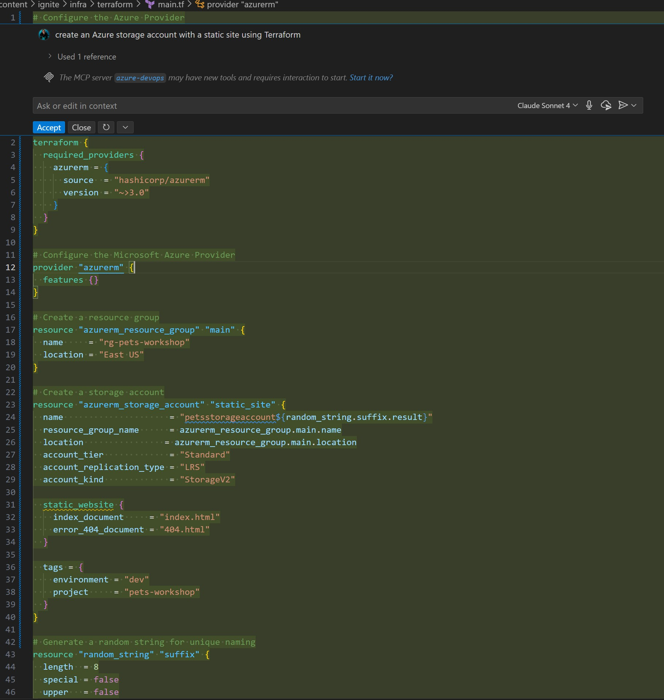

# Working with Terraform Using GitHub Copilot

## Learning Objectives
By the end of this workshop, you will:
- Use GitHub Copilot to generate Terraform configuration files
- Create reusable Terraform modules with Copilot assistance  
- Generate GitHub Actions workflows for CI/CD deployment
- Configure Copilot instruction files for better context

**Estimated Time:** 45-60 minutes

Infrastructure as Code (IaC) lets teams define, provision, and manage cloud infrastructure using code. This brings the benefits of version control, automation, and repeatability to infrastructure management.

Tools like Terraform and Bicep make it easier to describe and deploy cloud resources declaratively. However, writing and maintaining IaC files can still take time and may be prone to errors.

This is where GitHub Copilot excels.

## Why Use GitHub Copilot for IaC?

GitHub Copilot helps you write, refactor, and understand IaC templates quickly. Using natural language prompts and contextual awareness, Copilot can:

- **Generate infrastructure templates from plain language descriptions** — For example, describe a resource you need, such as “create an Azure storage account with a private endpoint,” and Copilot will suggest the Terraform or Bicep code to do it.
- **Reduce syntax errors and boilerplate code** — Copilot understands the structure and schema of Terraform and Bicep resources, minimizing typos and repetitive declarations.
- **Speed up resource creation** — Copilot quickly scaffolds configurations, including providers, variables, modules, and outputs.
- **Improve readability and maintainability** — Copilot can add comments, generate variable documentation, and suggest consistent naming conventions.
- **Support learning and experimentation** — You can explore and refine configurations interactively instead of memorizing every resource property.

GitHub Copilot doesn’t replace your understanding of Terraform or Bicep. Instead, it enhances your workflow—reducing friction and helping you focus on design and intent, not just syntax.

## Scenario

Your application includes a database, a website, and an API. Though everything is currently hosted locally in your repository, you want to deploy to Azure using an automated process for Infrastructure as Code. This reduces human error in deployments and introduces continuous integration and continuous delivery (CI/CD) practices. 

In this workshop, you will create either a Bicep or Terraform configuration file and a GitHub Actions workflow to deploy to Azure. Choose which technology you prefer and follow the relevant section below.

> **Note:** The same workflow can be applied to other cloud providers. Copilot can also suggest Terraform code for AWS, GCP, and more.

## Prerequisites

Everything you need for this exercise is already set up:

- GitHub Copilot enabled in your IDE  
- HashiCorp Terraform extension for VSCode (`.tf` files)  
- Bicep extension for VSCode (`.bicep` files)  

## Prompting Terraform with Copilot

Once your environment is ready, let’s use GitHub Copilot to create your first Terraform configuration file.

Terraform lets you define infrastructure declaratively—specifying what you want, not how to build it. Copilot enhances this by suggesting Terraform code right in your editor, driven by your descriptions.

In this scenario, you will create a Terraform configuration file with Copilot, and then generate a deployment workflow.

1. []**Open VSCode.**
2. []**Create a new file** under `infra/terraform` named `main.tf`.
3. []**Activate Copilot Chat Inline**  
   Place your cursor at the top of the file and press `Ctrl + I`.  
   This opens Copilot Chat Inline, where you can ask Copilot to  
   “create an Azure storage account with a static site using Terraform.”  
   Review Copilot’s suggestion first; you can modify it or click **Accept** to use it.  

   

   You’ve used inline Copilot to work directly in your IDE. This not only works for new code but allows multiple edits in a file so you can quickly iterate your code.

4. []**Open Copilot Chat** by clicking the Copilot icon in the VSCode top bar.  
   

5. []**Learn Slash Commands**  
   In Copilot Chat, use slash commands for frequent tasks. Type `/` to view available commands, or check the [GitHub Copilot Chat cheat sheet](https://docs.github.com/copilot/reference/github-copilot-chat-cheat-sheet#slash-commands) for details.

   Some useful examples are:
   - `/doc` — Add a documentation comment  
   - `/explain` — Explain your code  
   - `/fix` — Propose a fix  
   - `/generate` — Create code as needed  

   Type `/explain` to get an in-depth explanation of the generated code. This is helpful for learning about existing files and new projects.

   

6. []**Create Reusable Infrastructure**  
   Next, make your infrastructure reusable and scalable for Azure by asking Copilot:  
   “Generate a Terraform module for the static site and storage account so it can be used in multiple environments.”  
   Copilot should suggest multiple files and environments; you can further modify or adjust as needed.

7. []**Generate a Deployment Workflow**  
   Since Copilot has suggested multiple environments, create a deployment pipeline in GitHub by asking:  
   “Create a deployment YAML workflow to deploy to Azure.”  
   Copilot will generate a multi-step YAML workflow you can use.

```YAML
name: Deploy Infrastructure with Terraform

on:
  push:
    branches: [main]
    paths:
      - 'content/ignite/infra/terraform/**'
      - '.github/workflows/terraform-deploy.yml'
  pull_request:
    branches: [main]
    paths:
      - 'content/ignite/infra/terraform/**'
  workflow_dispatch:
    inputs:
      environment:
        description: 'Environment to deploy to'
        required: true
        default: 'dev'
        type: choice
        options:
          - dev
          - staging
          - prod
      terraform_action:
        description: 'Terraform action to perform'
        required: true
        default: 'plan'
        type: choice
        options:
          - plan
          - apply
          - destroy

env:
  ARM_CLIENT_ID: ${{ secrets.AZURE_CLIENT_ID }}
  ARM_CLIENT_SECRET: ${{ secrets.AZURE_CLIENT_SECRET }}
  ARM_SUBSCRIPTION_ID: ${{ secrets.AZURE_SUBSCRIPTION_ID }}
  ARM_TENANT_ID: ${{ secrets.AZURE_TENANT_ID }}
  TF_VERSION: '1.5.0'

jobs:
  terraform-plan:
    name: 'Terraform Plan'
    runs-on: ubuntu-latest
    strategy:
      matrix:
        environment: 
          - ${{ github.event.inputs.environment || 'dev' }}
    
    defaults:
      run:
        shell: bash
        working-directory: ./content/ignite/infra/terraform

    outputs:
      tfplanExitCode: ${{ steps.tf-plan.outputs.exitcode }}
      environment: ${{ matrix.environment }}

    steps:
    - name: Checkout
      uses: actions/checkout@v4

    - name: Setup Terraform
      uses: hashicorp/setup-terraform@v3
      with:
        terraform_version: ${{ env.TF_VERSION }}
        terraform_wrapper: false

    - name: Terraform Format Check
      id: fmt
      run: terraform fmt -check -recursive
      continue-on-error: true

    - name: Terraform Init
      id: init
      run: |
        terraform init \
          -backend-config="resource_group_name=${{ secrets.TERRAFORM_STATE_RG }}" \
          -backend-config="storage_account_name=${{ secrets.TERRAFORM_STATE_STORAGE }}" \
          -backend-config="container_name=tfstate" \
          -backend-config="key=pets-workshop-${{ matrix.environment }}.tfstate"

    - name: Terraform Validate
      id: validate
      run: terraform validate

    - name: Terraform Plan
      id: tf-plan
      run: |
        export exitcode=0
        terraform plan \
          -var-file="terraform.tfvars.${{ matrix.environment }}" \
          -detailed-exitcode \
          -no-color \
          -out tfplan || export exitcode=$?

        echo "exitcode=$exitcode" >> $GITHUB_OUTPUT
        
        if [ $exitcode -eq 1 ]; then
          echo Terraform Plan Failed!
          exit 1
        else 
          exit 0
        fi

    - name: Publish Terraform Plan
      uses: actions/upload-artifact@v4
      if: steps.tf-plan.outputs.exitcode == 2
      with:
        name: tfplan-${{ matrix.environment }}
        path: ./content/ignite/infra/terraform/tfplan

    - name: Create String Output
      id: tf-plan-string
      if: steps.tf-plan.outputs.exitcode == 2
      run: |
        TERRAFORM_PLAN=$(terraform show -no-color tfplan)
        
        delimiter="$(openssl rand -hex 8)"
        echo "summary<<${delimiter}" >> $GITHUB_OUTPUT
        echo "## Terraform Plan Output for ${{ matrix.environment }}" >> $GITHUB_OUTPUT
        echo "<details><summary>Click to expand</summary>" >> $GITHUB_OUTPUT
        echo "" >> $GITHUB_OUTPUT
        echo '```terraform' >> $GITHUB_OUTPUT
        echo "$TERRAFORM_PLAN" >> $GITHUB_OUTPUT
        echo '```' >> $GITHUB_OUTPUT
        echo "</details>" >> $GITHUB_OUTPUT
        echo "${delimiter}" >> $GITHUB_OUTPUT

    - name: Publish Terraform Plan to Task Summary
      if: steps.tf-plan.outputs.exitcode == 2
      env:
        SUMMARY: ${{ steps.tf-plan-string.outputs.summary }}
      run: |
        echo "$SUMMARY" >> $GITHUB_STEP_SUMMARY

    - name: Comment PR with Terraform Plan
      uses: actions/github-script@v7
      if: github.event_name == 'pull_request' && steps.tf-plan.outputs.exitcode == 2
      env:
        SUMMARY: "${{ steps.tf-plan-string.outputs.summary }}"
      with:
        github-token: ${{ secrets.GITHUB_TOKEN }}
        script: |
          // 1. Retrieve existing bot comments for the PR
          const { data: comments } = await github.rest.issues.listComments({
            owner: context.repo.owner,
            repo: context.repo.repo,
            issue_number: context.issue.number,
          });
          const botComment = comments.find(comment => {
            return comment.user.type === 'Bot' && comment.body.includes('Terraform Plan Output for ${{ matrix.environment }}');
          });

          // 2. Prepare format of the comment
          const output = `#### Terraform Format and Style 🖌\`${{ steps.fmt.outcome }}\`
          #### Terraform Initialization ⚙️\`${{ steps.init.outcome }}\`
          #### Terraform Validation 🤖\`${{ steps.validate.outcome }}\`
          #### Terraform Plan 📖\`${{ steps.tf-plan.outcome }}\`

          <details><summary>Show Plan for ${{ matrix.environment }}</summary>

          \`\`\`terraform
          ${process.env.SUMMARY}
          \`\`\`

          </details>

          *Pusher: @${{ github.actor }}, Action: \`${{ github.event_name }}\`, Workflow: \`${{ github.workflow }}\`*`;

          // 3. If we have a comment, update it, otherwise create a new one
          if (botComment) {
            github.rest.issues.updateComment({
              owner: context.repo.owner,
              repo: context.repo.repo,
              comment_id: botComment.id,
              body: output
            });
          } else {
            github.rest.issues.createComment({
              issue_number: context.issue.number,
              owner: context.repo.owner,
              repo: context.repo.repo,
              body: output
            });
          }

  terraform-apply:
    name: 'Terraform Apply'
    if: |
      (github.ref == 'refs/heads/main' && github.event_name == 'push') ||
      (github.event_name == 'workflow_dispatch' && github.event.inputs.terraform_action == 'apply')
    runs-on: ubuntu-latest
    environment: 
      name: ${{ needs.terraform-plan.outputs.environment }}
      url: ${{ steps.terraform-output.outputs.static_website_url }}
    needs: [terraform-plan]
    
    defaults:
      run:
        shell: bash
        working-directory: ./content/ignite/infra/terraform

    steps:
    - name: Checkout
      uses: actions/checkout@v4

    - name: Setup Terraform
      uses: hashicorp/setup-terraform@v3
      with:
        terraform_version: ${{ env.TF_VERSION }}
        terraform_wrapper: false

    - name: Terraform Init
      run: |
        terraform init \
          -backend-config="resource_group_name=${{ secrets.TERRAFORM_STATE_RG }}" \
          -backend-config="storage_account_name=${{ secrets.TERRAFORM_STATE_STORAGE }}" \
          -backend-config="container_name=tfstate" \
          -backend-config="key=pets-workshop-${{ needs.terraform-plan.outputs.environment }}.tfstate"

    - name: Download Terraform Plan
      uses: actions/download-artifact@v4
      if: needs.terraform-plan.outputs.tfplanExitCode == 2
      with:
        name: tfplan-${{ needs.terraform-plan.outputs.environment }}
        path: ./content/ignite/infra/terraform/

    - name: Terraform Apply
      if: needs.terraform-plan.outputs.tfplanExitCode == 2
      run: terraform apply -auto-approve tfplan

    - name: Get Terraform Output
      id: terraform-output
      run: |
        echo "static_website_url=$(terraform output -raw current_static_website_url)" >> $GITHUB_OUTPUT
        echo "storage_account_name=$(terraform output -raw current_storage_account_name)" >> $GITHUB_OUTPUT
        echo "resource_group_name=$(terraform output -raw resource_group_name)" >> $GITHUB_OUTPUT

  terraform-destroy:
    name: 'Terraform Destroy'
    if: github.event_name == 'workflow_dispatch' && github.event.inputs.terraform_action == 'destroy'
    runs-on: ubuntu-latest
    environment: 
      name: ${{ github.event.inputs.environment }}-destroy
    needs: [terraform-plan]
    
    defaults:
      run:
        shell: bash
        working-directory: ./content/ignite/infra/terraform

    steps:
    - name: Checkout
      uses: actions/checkout@v4

    - name: Setup Terraform
      uses: hashicorp/setup-terraform@v3
      with:
        terraform_version: ${{ env.TF_VERSION }}
        terraform_wrapper: false

    - name: Terraform Init
      run: |
        terraform init \
          -backend-config="resource_group_name=${{ secrets.TERRAFORM_STATE_RG }}" \
          -backend-config="storage_account_name=${{ secrets.TERRAFORM_STATE_STORAGE }}" \
          -backend-config="container_name=tfstate" \
          -backend-config="key=pets-workshop-${{ github.event.inputs.environment }}.tfstate"

    - name: Terraform Destroy
      run: |
        terraform destroy \
          -var-file="terraform.tfvars.${{ github.event.inputs.environment }}" \
          -auto-approve

  deploy-frontend:
    name: 'Deploy Frontend'
    if: needs.terraform-apply.result == 'success'
    runs-on: ubuntu-latest
    needs: [terraform-apply]
    
    defaults:
      run:
        shell: bash

    steps:
    - name: Checkout
      uses: actions/checkout@v4

    - name: Setup Node.js
      uses: actions/setup-node@v4
      with:
        node-version: '18'
        cache: 'npm'
        cache-dependency-path: './client/package-lock.json'

    - name: Install dependencies
      working-directory: ./client
      run: npm ci

    - name: Build frontend
      working-directory: ./client
      run: npm run build

    - name: Azure CLI Login
      uses: azure/login@v1
      with:
        creds: |
          {
            "clientId": "${{ secrets.AZURE_CLIENT_ID }}",
            "clientSecret": "${{ secrets.AZURE_CLIENT_SECRET }}",
            "subscriptionId": "${{ secrets.AZURE_SUBSCRIPTION_ID }}",
            "tenantId": "${{ secrets.AZURE_TENANT_ID }}"
          }

    - name: Deploy to Azure Storage
      run: |
        az storage blob upload-batch \
          --account-name ${{ needs.terraform-apply.outputs.storage_account_name }} \
          --destination '$web' \
          --source ./client/dist \
          --overwrite true

    - name: Logout from Azure
      run: az logout
      if: always()

    - name: Summary
      run: |
        echo "## Deployment Summary" >> $GITHUB_STEP_SUMMARY
        echo "✅ Frontend deployed successfully!" >> $GITHUB_STEP_SUMMARY
        echo "🌐 Website URL: ${{ needs.terraform-apply.outputs.static_website_url }}" >> $GITHUB_STEP_SUMMARY
        echo "📦 Storage Account: ${{ needs.terraform-apply.outputs.storage_account_name }}" >> $GITHUB_STEP_SUMMARY
        echo "🏷️ Resource Group: ${{ needs.terraform-apply.outputs.resource_group_name }}" >> $GITHUB_STEP_SUMMARY
```
8.  **Next Steps**
   - Iterate on the output to match your environment.  
   - Add tests to your Terraform code (recommended).  
   - Ask Copilot to review your code for security.
    
9. The output in this lab is a great starting point, but to improve the output of Copilot, it's critical that we improve the amount of context that it is given. One of the best ways to do this is by using an instructions file:

GitHub Copilot instruction files are Markdown documents that give Copilot the context it needs to understand your Terraform project. These files help Copilot generate code that aligns with your team’s standards, naming conventions, and infrastructure patterns.

There are two types of instruction files:

- **Global instructions** — Apply to the whole repository and are stored in `copilot-instructions.md`.  
- **Scoped instructions** — Apply to specific folders or modules and are stored in `.github/instructions/*instructions.md`.  

By adding clear context—such as preferred Terraform module structures, naming rules, backend configurations, or resource tagging strategies—you help Copilot suggest code that fits seamlessly into your workflows. For instance, Copilot can generate Terraform modules that follow your variable naming patterns, use your standard providers, or include required tags and outputs automatically.

These instruction files also improve collaboration. New contributors get consistent, project-aligned suggestions without heavy onboarding, and your team benefits from more uniform, readable code across environments.

With well-written instructions, Copilot becomes a project-aware Terraform assistant that writes, updates, and refactors your IaC with your team’s practices in mind.

Let's create our first global custom instructions file!

10. []**Create** a new file named `copilot-instructions.md` inside the `.github` directory.
11. []**Ask Copilot:**  
   “Create a global instructions file for using Terraform.”  
   Review the output—it should include general practices, naming conventions, required providers, and module development guidance. Use it as a starting point and customize it to your team’s standards.
12. []**Enhance Context with Scoped Files**  
   You can also create scoped instruction files that apply only to specific directories or modules.  
   - Create a subdirectory `.github/instructions`.  
   - Save scoped instruction files with a `.instructions.md` extension inside this folder.

Your output from Copilot will improve significantly as it gains more context about your project. Give it a try!

